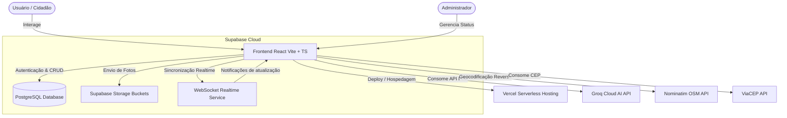
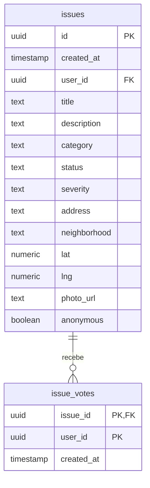

# Relatório Técnico-Acadêmico: Projeto ZelaBelém
**Eixo 1 – Cidade, Mobilidade e Cidadania (Belém)**
**Projeto 1 – Sistema Colaborativo de Problemas Urbanos**

Este documento apresenta a fundamentação teórica, arquitetura e detalhamento técnico do sistema **ZelaBelém**, desenvolvido como um protótipo funcional integrado e implantado em nuvem.

---

## 1. Problema Identificado (Contexto Real de Belém)
A cidade de Belém, capital do Pará, enfrenta desafios crônicos em sua infraestrutura urbana. Problemas como vias com buracos asfálticos profundos, iluminação pública ineficiente em bairros periféricos, descarte inadequado de resíduos sólidos (lixo irregular) e alagamentos recorrentes durante períodos de chuvas fortes (intensificados pelo regime de marés e canais urbanos) impactam diariamente a mobilidade, segurança e qualidade de vida da população. 

Atualmente, os canais oficiais de comunicação entre o cidadão e a gestão municipal (como SESAN, Seurb e Defesa Civil) carecem de transparência, agilidade e engajamento comunitário. Não há visibilidade pública dos problemas relatados, impossibilitando que a própria comunidade se mobilize, apoie e priorize as demandas mais críticas.

---

## 2. Objetivo da Solução
O **ZelaBelém** é uma central colaborativa de inteligência urbana que visa preencher essa lacuna por meio de uma plataforma web moderna e interativa. Os objetivos principais são:
* **Empoderamento do Cidadão**: Permitir que qualquer morador registre ocorrências de forma geolocalizada no mapa de Belém, descrevendo o problema e anexando fotos como evidência.
* **Priorização Colaborativa (Apoio Popular)**: Possibilitar que outros cidadãos apoiem ocorrências existentes, gerando dados de engajamento que ajudam o poder público a identificar as áreas de maior criticidade.
* **Transparência e Gestão**: Fornecer um painel administrativo seguro onde gestores públicos ou técnicos autorizados analisam as demandas, atualizam os status em tempo real e tomam decisões baseadas em métricas.
* **Acessibilidade Inteligente**: Integrar um assistente virtual assistido por IA ("Assistente Zé") que conversa com o usuário em linguagem natural para redigir o rascunho de uma ocorrência automaticamente.

---

## 3. Público-Alvo
* **Cidadãos de Belém**: Pedestres, motoristas e moradores que desejam relatar falhas na infraestrutura de seus bairros de maneira rápida e visual.
* **Gestores e Técnicos Municipais**: Agentes da administração pública encarregados da triagem, fiscalização e reparo de ocorrências urbanas, que necessitam de dados consolidados e ferramentas de atualização de status.

---

## 4. Disciplinas Integradas
O desenvolvimento do ZelaBelém consolidou conhecimentos práticos de cinco grandes disciplinas da computação:

1. **Engenharia de Software**:
   * Adoção de metodologias ágeis e arquitetura modular de componentes em React.
   * Uso de tipagem estática com TypeScript para garantir robustez, prevenção de erros em tempo de compilação e manutenibilidade do código.
   * Implementação de controle de estado reativo e fluxo de dados unidirecional.
2. **Banco de Dados**:
   * Projeto físico de banco de dados relacional utilizando PostgreSQL (via Supabase).
   * Implementação de chaves estrangeiras, restrições exclusivas (preventing duplicate votes) e criação de views agregadoras (`issue_vote_counts`) para otimizar a contagem de votos.
3. **Arquitetura de Software**:
   * Padrão cliente-servidor desacoplado com consumo de APIs RESTful e WebSockets.
   * Integração de múltiplos serviços externos: Supabase (dados e autenticação), Nominatim/ViaCEP (geocodificação e endereço), Groq Cloud API (Inteligência Artificial Llama-3) e Leaflet (renderização e controle de mapas).
4. **Cloud Computing**:
   * Implantação contínua (CI/CD) do frontend em plataforma serverless global (Vercel).
   * Utilização de banco de dados hospedado em nuvem (Supabase DB) e serviços de armazenamento de objetos (Supabase Storage) com políticas de segurança de linha (RLS) configuradas.
5. **UX/UI (Design de Experiência do Usuário)**:
   * Interface moderna com suporte nativo a temas Dark/Light.
   * Design responsivo adaptado para múltiplos tamanhos de tela.
   * Micro-animações e transições suaves, além de painéis interativos (chat conversacional e mapa dinâmico) que melhoram a usabilidade.

---

## 5. Arquitetura da Solução

O sistema opera sob uma arquitetura de microsserviços integrados no cliente:



---

## 6. Modelo de Dados

O banco de dados PostgreSQL é estruturado a partir de duas tabelas centrais e uma view agregadora, garantindo a integridade dos dados e o suporte a múltiplos usuários.

### Diagrama Entidade-Relacionamento (ERD)



### Código SQL de Criação (DDL)

```sql
-- 1. Criação da tabela principal de Ocorrências (Issues)
CREATE TABLE public.issues (
  id UUID PRIMARY KEY DEFAULT gen_random_uuid(),
  created_at TIMESTAMP WITH TIME ZONE DEFAULT timezone('utc'::text, now()) NOT NULL,
  user_id UUID REFERENCES auth.users(id) ON DELETE CASCADE NOT NULL,
  title TEXT NOT NULL,
  description TEXT,
  category TEXT NOT NULL,
  status TEXT DEFAULT 'aberto'::text NOT NULL,
  severity TEXT DEFAULT 'medium'::text NOT NULL,
  address TEXT,
  neighborhood TEXT,
  lat NUMERIC NOT NULL,
  lng NUMERIC NOT NULL,
  photo_url TEXT,
  anonymous BOOLEAN DEFAULT false NOT NULL
);

-- Habilita Row Level Security (RLS) para proteção
ALTER TABLE public.issues ENABLE ROW LEVEL SECURITY;

-- Políticas de RLS da tabela 'issues'
CREATE POLICY "Permitir leitura para todos" ON public.issues FOR SELECT USING (true);
CREATE POLICY "Permitir inserção para usuários autenticados" ON public.issues FOR INSERT WITH CHECK (auth.uid() = user_id);
CREATE POLICY "Permitir atualização de status para administradores/todos" ON public.issues FOR UPDATE USING (true) WITH CHECK (true);

-- 2. Criação da tabela de Votos de Apoio (Issue Votes)
CREATE TABLE public.issue_votes (
  issue_id UUID REFERENCES public.issues(id) ON DELETE CASCADE NOT NULL,
  user_id UUID REFERENCES auth.users(id) ON DELETE CASCADE NOT NULL,
  created_at TIMESTAMP WITH TIME ZONE DEFAULT timezone('utc'::text, now()) NOT NULL,
  PRIMARY KEY (issue_id, user_id)
);

-- Habilita RLS na tabela de votos
ALTER TABLE public.issue_votes ENABLE ROW LEVEL SECURITY;

CREATE POLICY "Permitir leitura de votos para todos" ON public.issue_votes FOR SELECT USING (true);
CREATE POLICY "Permitir votar para usuários autenticados" ON public.issue_votes FOR INSERT WITH CHECK (auth.uid() = user_id);
CREATE POLICY "Permitir remover voto para o dono do voto" ON public.issue_votes FOR DELETE USING (auth.uid() = user_id);

-- 3. Criação da View de contagem de votos acumulados
CREATE VIEW public.issue_vote_counts AS
SELECT issue_id, COUNT(*) AS count
FROM public.issue_votes
GROUP BY issue_id;
```

---

## 7. Protótipo e Sistema Funcional
O protótipo construído é composto por três fluxos principais:

1. **Interface do Cidadão (Colaborador)**:
   * **Mapa Interativo (Leaflet)**: Exibe os pins das ocorrências coloridos de acordo com a severidade (Verde: Baixa, Laranja: Média, Vermelho: Alta).
   * **Formulário de Relato**: Permite digitar o endereço ou clicar no mapa para capturar as coordenadas exatas por geocodificação reversa.
   * **Upload e Compressão**: Processa a foto anexada reduzindo-a para uma versão otimizada (JPEG a 70% e no máximo 800x800 pixels) para inserção leve via Base64 ou upload no Storage.
   * **Assistente Conversacional (IA)**: O "Assistente Zé" conversa por chat e gera rascunhos de ocorrências editáveis dinamicamente.
2. **Interface do Administrador (Gestão)**:
   * **Banner Informativo**: Identifica o modo de edição administrativo ativo.
   * **Painel de Métricas**: Cards agregadores de tempo médio de resolução, bairros com mais incidentes e problemas dominantes.
   * **Controle de Status**: Comboboxes nos cards e no detalhamento que atualizam o status da ocorrência (`aberta`, `em análise`, `resolvida`) de forma síncrona no banco de dados.
3. **Mecanismo Realtime**:
   * O frontend escuta alterações via WebSockets do Supabase, atualizando a listagem lateral e o mapa do cidadão no instante em que o administrador altera o status ou uma nova ocorrência é adicionada.

---

## 8. Deploy e Simulação em Nuvem
* **Hospedagem da Aplicação**: Deploy ativo na Vercel através de integração contínua ligada ao repositório GitHub do projeto.
  * **Endereço da Aplicação**: [https://zelabelem.vercel.app/](https://zelabelem.vercel.app/)
* **Banco de Dados e Serviços de Nuvem**: Supabase Cloud (região AWS us-east-1). Banco PostgreSQL e tabelas com políticas RLS ativas para segurança e escalabilidade.

---

## 9. Impacto Social Esperado
A adoção do **ZelaBelém** propicia:
* **Fomento à Cidadania Ativa**: Incentiva os munícipes a se tornarem agentes fiscalizadores ativos da infraestrutura pública.
* **Transparência Governamental**: Expõe as carências reais dos bairros e permite o acompanhamento visual do tempo de resolução por parte da prefeitura.
* **Priorização Inteligente de Recursos**: Ajuda o poder público municipal a direcionar verbas de manutenção com base na quantidade de apoios acumulados de cada problema, atacando primeiro as falhas que mais impactam os cidadãos.

---

## 10. Avaliação Crítica (Limitações e Melhorias Futuras)

### Limitações Atuais do Protótipo
* **Autenticação Descentralizada**: O login administrativo atualmente é realizado via validação local de credenciais, necessitando de uma tabela de perfis de usuário mais robusta com autenticação baseada em funções (RBAC) no banco de dados.
* **Dependência de APIs de Terceiros**: O Nominatim (OpenStreetMap) possui limitações de requisição (rate limits) em uso intensivo.
* **Verificação Manual**: Atualmente, qualquer ocorrência criada aparece no mapa instantaneamente, o que abre margem para relatos falsos ou duplicados.

### Melhorias Futuras Propostas
1. **Inteligência Artificial na Imagem**: Integração de algoritmos de Visão Computacional para analisar a foto enviada pelo usuário e sugerir automaticamente a categoria (ex: detectar se há buraco, lixo ou vazamento).
2. **Sistema de Reputação e Moderação**: Atribuição de "pontuação de cidadania" baseada no histórico de relatos validados do usuário, ajudando a combater spam e notícias falsas.
3. **Notificações Push**: Envio automático de mensagens no celular/e-mail do cidadão quando o status da ocorrência que ele relatou (ou apoia) for alterada de "em análise" para "resolvida".
4. **Modo Offline**: Suporte a Progressive Web App (PWA) e Service Workers para permitir o registro de ocorrências em locais sem conexão de dados (zona rural, ilhas de Belém), sincronizando automaticamente quando o sinal for restabelecido.
